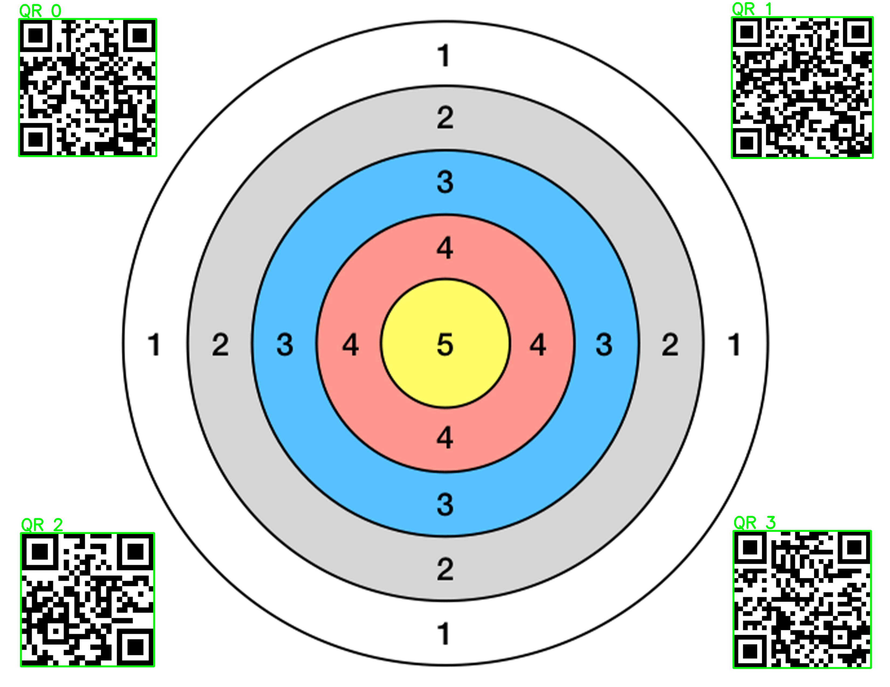
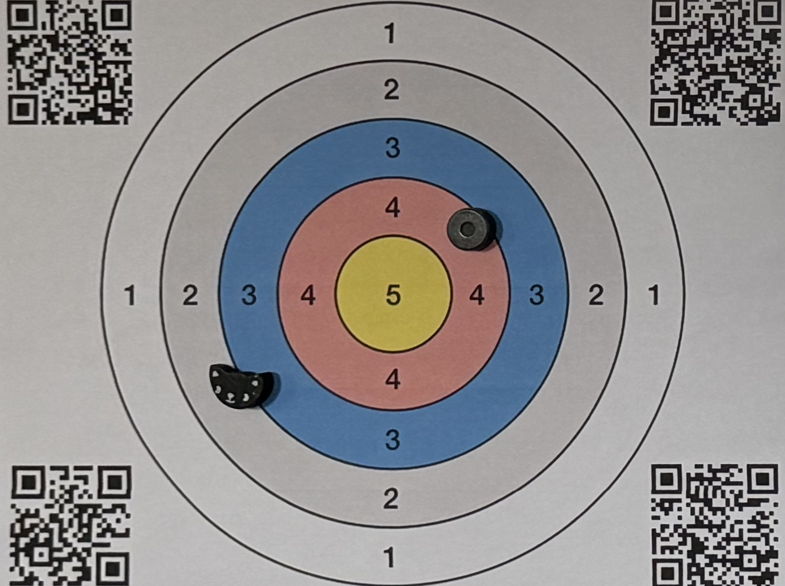

# QR Code Detection and Processing Project

This repository contains the implementation of a robust QR code detection and processing pipeline. The project highlights the use of YOLO (You Only Look Once) for detecting QR codes in real-world environments and demonstrates advanced techniques for handling noisy data, occlusions, and variations in lighting.

## Features

- **QR Code Detection:** Leveraging a custom-trained YOLO model for accurate QR code detection.
- **Robust Dataset Creation:** A simulated dataset featuring:
  - Geometric transformations (rotations, translations, scaling)
  - Contrast changes
  - Partial shading and occlusions
  - Environmental noise
- **Error Handling:** Identifying and removing incorrect detections.
- **QR Code Warping:** Flattening detected QR codes to standardize their appearance.
- **Data Transmission:** Sending processed QR code data to another device for further analysis.

## Project Workflow

1. **Dataset Creation:**
   - Simulated a diverse dataset using transformations, contrast adjustments, and occlusions to mimic real-world scenarios.
   - Augmented data to improve model robustness under varying conditions.

2. **Model Training:**
   - Trained the YOLO model on the simulated dataset.
   - Fine-tuned hyperparameters to maximize detection accuracy.
   - Comparison to OpenCV's QR code detection

3. **Detection and Processing:**
   - Detected QR codes in images or video streams.
   - Filtered out false positives using confidence thresholds and geometric checks.
   - Warped the detected QR codes to a flat orientation for consistent processing.

4. **Integration:**
   - Stream flattened QR code images or decoded data to a connected device upon request via interface.

## Progress

### Initial Target File

### Initial Detection and Validation via Template Matching

### Output

## Future Work

- Develop GUI for interaction with camera system.
- Experiment with range extending hardware.
- Enable stream connection.
- Experiment with Google Coral for enabling model implementation.
